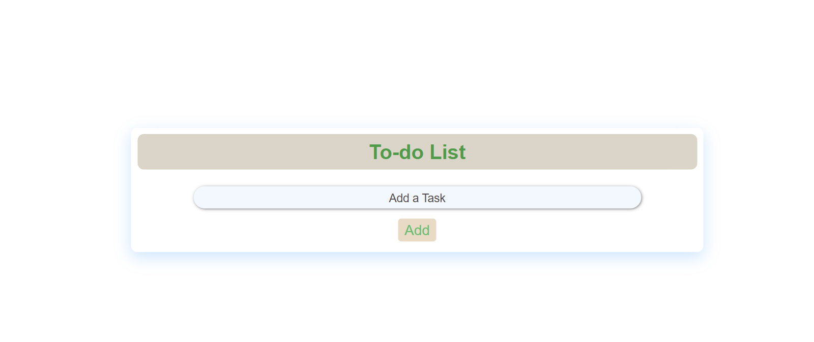
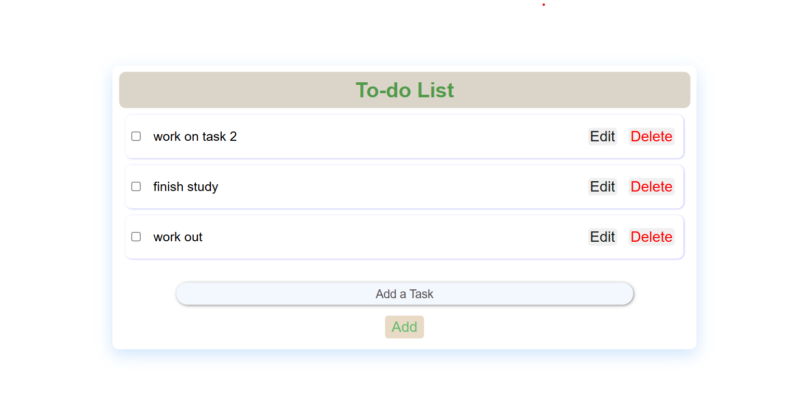
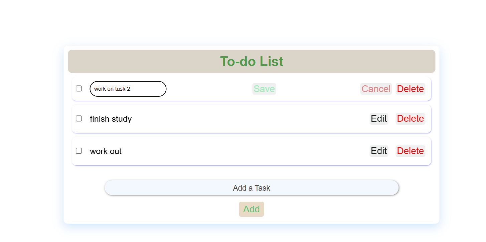
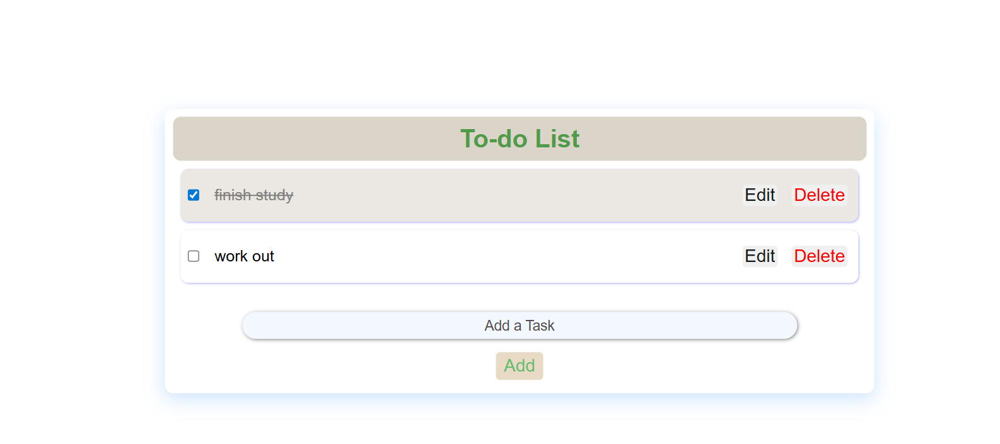
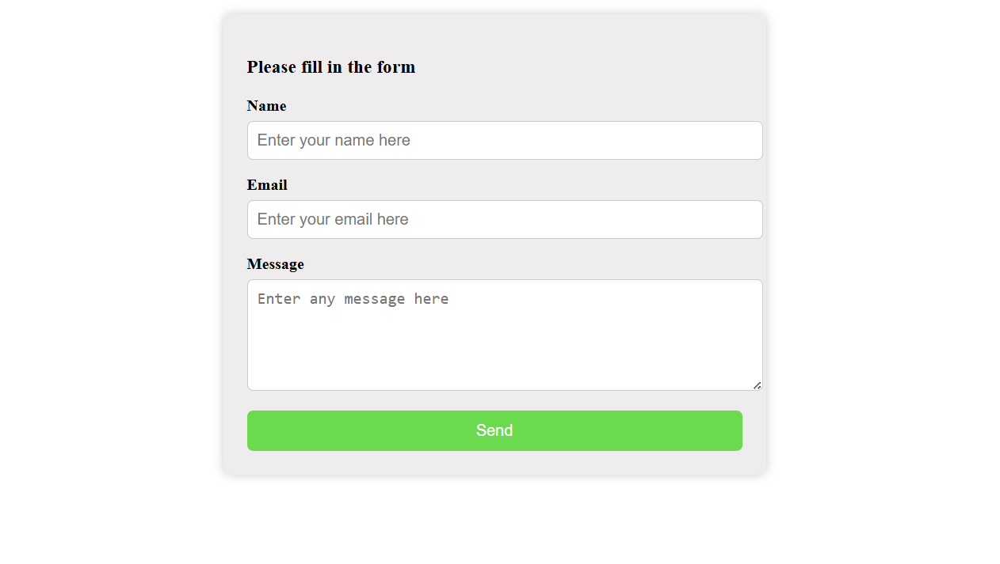

# A2SV Tasks

This repository contains my frontend development tasks for the A2SV learning program.

## Task 1 - Simple To-Do List App

A basic HTML/CSS/JavaScript to-do list where users can add and remove tasks.

## Task 2 - simple To-Do List App Typescript version

A basic HTML/CSS/TypeScript to-do list where users can add, edit and remove tasks.

## Task 4 - simple To-Do List App using React and Typescript

A simple and responsive Todo List application built using **React**, **TypeScript**, and **Vite**.  
Features include:

- Add, edit, delete todos
- Mark todos as completed
- Data saved locally using a custom service

### 1. Clone the repository

```bash
git clone https://github.com/TsionMengistu12/A2SV_tasks.git
cd A2SV_tasks
```

### 2. Install dependencies

Make sure you have Node.js and npm installed.

bash
npm install

### Features

Add new todos
Edit todos with inline input
Delete individual todos
Mark todos as completed via checkbox
Smooth UI transitions and responsive layout

# home page

  
The home screen shows the empty to-do list with the input field and "Add" button.

# Task Added

  
After typing a task and pressing Add, the task appears in a card with a checkbox and Edit and Delete button.

# Editing Tasks


The app alows for the tasks to be edited if while editing we would like to stop and return to original we can press the cancle button
We can't edit already finished tasks

# Task Checked

  
When a task is clicked, it's marked complete — icon changes and the text will be striked through.

### Task 5 - conatct form

The form accepts name email and additional message to be submitted
utilized the useForm hook in react to achieve its functionality
It validates the email format and doesn't allow for an in-complete form to be submitted

# contact form look


